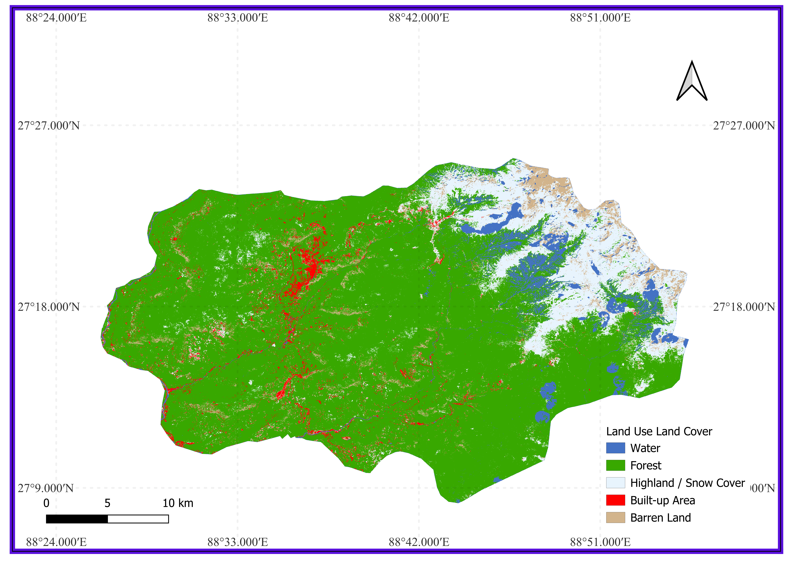

# 🛰️ LULC Classification — East Sikkim, India

<div align="center">


**Summer Training Programme on Remote Sensing and GIS – 2025**  
India Space Academy | Department of Space Education

**Prepared by:** Satwik Shreshth &nbsp;|&nbsp; MCA 2nd Year, Sikkim University (Central University)

</div>

---

## 📌 Overview

This project generates a **10-metre resolution Land Use Land Cover (LULC) map** of **East Sikkim district, Sikkim, India** using supervised ensemble machine learning classifiers trained on multi-temporal **Sentinel-2 Surface Reflectance** imagery. All satellite processing was performed on the **Google Earth Engine (GEE)** cloud computing platform; accuracy evaluation and visualisation were done in Python (scikit-learn) and **QGIS**.

Two classifiers are compared — **Random Forest (RF)** and **Gradient Tree Boosting (GTB)** — across five thematic land cover classes. RF was selected for the final map export.

---

## 🗺️ LULC Map



*10-m resolution LULC map of East Sikkim — Random Forest classifier, visualised in QGIS.*

| Symbol | Class |
|--------|-------|
| 🔵 Blue | Water |
| 🟢 Dark Green | Forest |
| ⬜ White | Highland / Snow Cover |
| 🔴 Red | Built-up Area |
|  Greyish Pink | Barren Land |

---

## 📂 Repository Structure

```
LULC_Classification/
│
├── 📁 EastSikkimSHP/                    # District boundary shapefile (FAO GAUL 2015)
│   ├── AOI_EastSikkim.shp
│   ├── AOI_EastSikkim.shx
│   ├── AOI_EastSikkim.dbf
│   └── AOI_EastSikkim.prj
│
├── 📁 TrainingPoint Gangtok/            # Manual ground-truth training points (GEE asset)
│
├── 📁 eval_plots_LULC_EastSikkim/       # All evaluation plots
│   ├── confusion_matrix_RF.png
│   ├── confusion_matrix_GTB.png
│   ├── roc_curves_RF.png
│   ├── roc_curves_GTB.png
│   ├── f1_comparison.png
│   ├── omission_commission.png
│   └── overall_accuracy_kappa.png
│
├── 📓 LULC.ipynb                        # Jupyter Notebook — Preprocessing, Feature Engineering, Training 	accuracy assessment & plots
├── 🖼️  LULC_East_Sikkim.png             # Final LULC map (PNG, QGIS export)
├── 🗂️  LULC_East_Sikkim_Clipped.tif     # Full-resolution clipped GeoTIFF
├── 🗂️  LULC_EastSikkim_RF.tif           # Random Forest classified raster (GeoTIFF)
├── 📦 eval_plots_LULC_EastSikkim.zip    # Compressed evaluation plots archive
├── 📄 report_data.json                  # Accuracy metrics and evaluation data
├── 📑 Report.pdf                        # Full project report
└── 📝 README.md                         # This file
```

---

## 🔬 Methodology

### Study Area

| Parameter | Value |
|-----------|-------|
| District | East Sikkim, Sikkim, India |
| Area | ~1,521.8 km² |
| Latitude | 27.14°N – 27.42°N |
| Longitude | 88.44°E – 88.92°E |
| Elevation Range | ~300 m to >4,000 m |
| Coordinate System | WGS84 / EPSG:4326 |

### Satellite Data & Pre-processing

- **Source:** `COPERNICUS/S2_SR_HARMONIZED` on Google Earth Engine
- **Period:** January 2020 – January 2024 | Cloud filter: <80%
- **Cloud Masking:** QA60 bitmask (bits 10 & 11); snow pixels preserved where NDSI > 0.40
- **Composite:** Pixel-wise median clipped to AOI

### Feature Stack (15 Features)

| Category | Features |
|----------|----------|
| Spectral Bands | B2, B3, B4, B8, B11, B12 |
| Spectral Indices | NDVI, NDWI, NDSI |
| Phenological | NDVIwin (Dec–Feb), NDVImon (Jun–Sep), NDVIdiff |
| Terrain (SRTM) | Elevation, Slope, Aspect |

### Land Cover Classes

| ID | Class | Description |
|----|-------|-------------|
| 0 | Water | Rivers, lakes, reservoirs |
| 1 | Forest | Dense / closed-canopy forest |
| 2 | Highland / Snow Cover | Alpine shrubland, seasonal snow, glaciers |
| 3 | Built-up Area | Urban areas, impervious surfaces |
| 4 | Barren Land | Bare rock, soil, scree |

### Training Data

| Source | Count |
|--------|-------|
| Manual ground-truth points (GEE digitisation) | 346 |
| ESA WorldCover 2021 stratified samples | 1,000 |
| **Total (after null removal)** | **1,337** |
| Training split (70%, seed=42) | 883 |
| Validation split (30%) | 425 |

### Classifiers (GEE SMILE Library)

| Classifier | Key Hyperparameters |
|------------|---------------------|
| Random Forest (RF) | 200 trees, 3 vars/split, min leaf = 2, seed = 42 |
| Gradient Tree Boosting (GTB) | 200 trees, shrinkage = 0.05, seed = 42 |

---

## 📊 Results

### Overall Accuracy

| Classifier | Overall Accuracy | Cohen's Kappa | Macro AUC-ROC |
|------------|:---------------:|:-------------:|:-------------:|
| Random Forest (RF) | 75.76% | 0.6956 | 0.9414 |
| Gradient Tree Boosting (GTB) | **76.00%** | **0.6990** | **0.9481** |

> Both Kappa values exceed 0.60 — confirming **substantial agreement** beyond chance.

### Per-class Metrics (%)

| Class | RF F1 | GTB F1 | RF AUC | GTB AUC |
|-------|:-----:|:------:|:------:|:-------:|
| Water | 81.77 | 80.45 | 0.9526 | 0.9556 |
| Forest | 73.68 | 73.47 | 0.9370 | 0.9498 |
| Highland / Snow Cover | 66.18 | 66.19 | 0.9207 | 0.9194 |
| **Built-up Area** | **86.41** | **87.56** | **0.9756** | **0.9767** |
| Barren Land | 62.71 | 66.67 | 0.9209 | 0.9391 |

> **Built-up Area** achieved the highest F1 (>86%) for both classifiers.  
> **GTB** outperforms RF by +3.96 F1 points for Barren Land.  
> **RF** achieves higher recall for Forest.  
> All five classes exceed AUC > 0.92 for both classifiers.

---

## ⚙️ Getting Started

### Prerequisites

- A [Google Earth Engine](https://earthengine.google.com/) account
- Python 3.8+ with `scikit-learn`, `matplotlib`, `numpy`, `pandas`
- QGIS 3.x (for map visualisation)

### Run the GEE Classification

1. Open [GEE Code Editor](https://code.earthengine.google.com/)
2. Copy the contents of `Script.js` and paste into the editor
3. Update the training asset path if needed:
   ```javascript
   var trainingData = ee.FeatureCollection('projects/YOUR_PROJECT/assets/training_gangtok');
   ```
4. Click **Run** — the LULC map will appear in the map panel
5. Go to the **Tasks** tab and click **Run** to export the GeoTIFF to Drive

### Run the Accuracy Assessment Notebook

```bash
git clone https://github.com/satwik-shreshth/LULC_Classification.git
cd LULC_Classification
pip install scikit-learn matplotlib numpy pandas
jupyter notebook LULC.ipynb
```

---

## 🛠️ Tools & Technologies

| Tool | Purpose |
|------|---------|
| Google Earth Engine | Cloud-based satellite data processing & classification |
| Sentinel-2 SR (ESA Copernicus) | Primary satellite imagery |
| USGS SRTM 30m DEM | Terrain features |
| ESA WorldCover 2021 | Stratified training sample source |
| FAO GAUL 2015 | District boundary |
| GEE SMILE Library | RF & GTB classifier training |
| scikit-learn | AUC-ROC, confusion matrices, evaluation plots |
| QGIS | Map cartography & export |
| Python / Jupyter | Analysis and visualisation |

---

## ⚠️ Limitations

- Overall accuracy of ~76% reflects inherent spectral mixing in complex Himalayan terrain at 10-m resolution
- WorldCover-derived samples may propagate label noise in transition zones
- No post-classification spatial smoothing — salt-and-pepper noise visible in heterogeneous zones
- Persistent monsoon cloud cover may introduce temporal bias at high-altitude pixels
- Area estimates from pixel counts have not been bias-corrected for map accuracy

---

## 🔭 Future Work

- **SAR-optical fusion** — Sentinel-1 SAR for improved snow/bare rock discrimination
- **Object-Based Image Analysis (OBIA)** — reduce noise at class boundaries
- **Deep learning** — CNN/U-Net approaches exploiting spatial context
- **Bias-corrected area estimation** — following Olofsson et al. (2014)
- **Temporal change detection** — multi-year LULC change mapping

---

## 🙏 Acknowledgements

- **India Space Academy (ISA)** — Summer Training Programme 2025 opportunity and mentorship
- **ESA** — Sentinel-2 data (Copernicus Programme) & WorldCover 2021
- **USGS** — SRTM Digital Elevation Model
- **Google LLC** — Earth Engine cloud platform
- **FAO** — GAUL boundary dataset

---


<div align="center">

*Report submitted: 12 August 2025 &nbsp;|&nbsp; India Space Academy, Department of Space Education*

⭐ If you found this useful, please star the repository!

</div>
